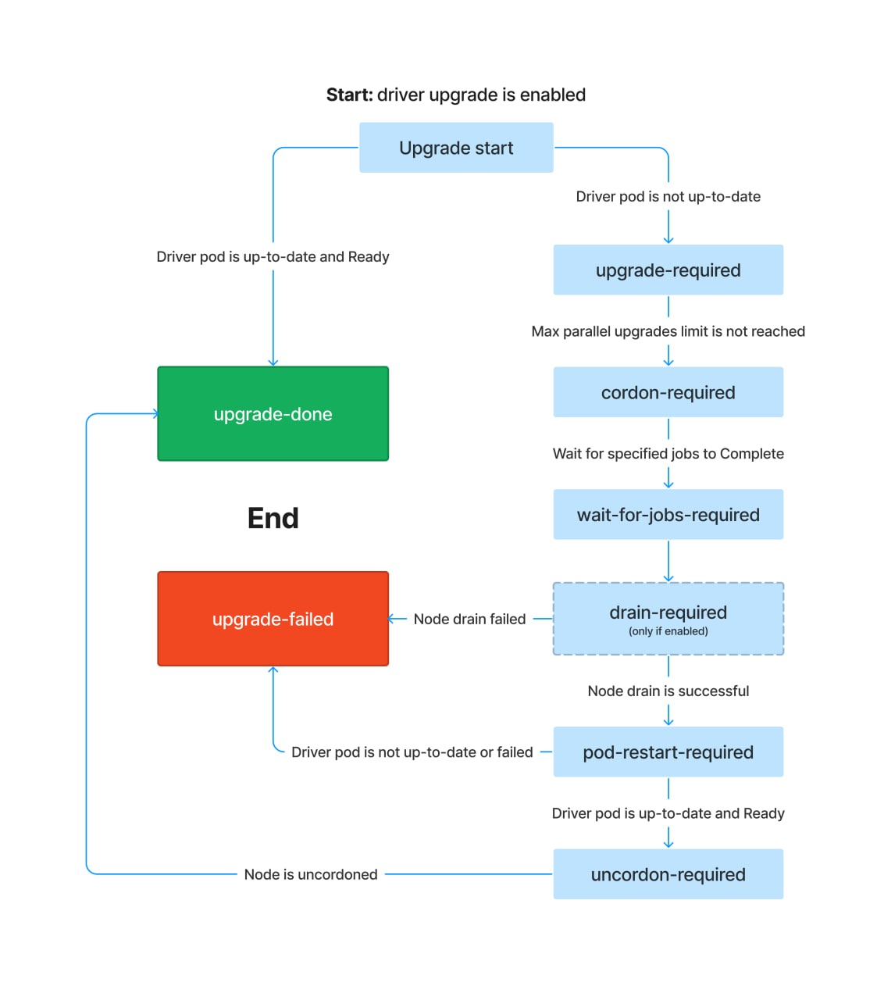

# Automatic MOFED Upgrade
When a containerized OFED driver is reloaded on the node, all PODs which use a secondary network based on NVIDIA Mellanox NICs will lose network interface in their containers.
To prevent the outage all PODs which use secondary network need to be removed from the node before driver POD is reloaded on that node.

It is possible to do a driver upgrade manually by following the [manual upgrade guide](host-ofed.md#upgrade-nvidia-mellanox-ofed). This procedure requires a lot of manual actions and can be error prone.

This document describes the automatic upgrade flow for the containerized OFED driver.

### Upgrade NVIDIA Mellanox OFED automatically
* Enable automatic MOFED upgrade, define UpgradePolicy section for ofedDriver in the [NicClusterPolicy spec:
```
apiVersion: mellanox.com/v1alpha1
kind: NicClusterPolicy
metadata:
  name: nic-cluster-policy
  namespace: nvidia-network-operator
spec:
  ofedDriver:
    image: mofed
    repository: mellanox
    version: 5.6-1.0.3.3
    upgradePolicy:
      # autoUpgrade is a global switch for automatic upgrade feature
	  # if set to false all other options are ignored
      autoUpgrade: true
      # maxParallelUpgrades indicates how many nodes can be upgraded in parallel
	  # 0 means no limit, all nodes will be upgraded in parallel
      maxParallelUpgrades: 0
      # describes the configuration for waiting on job completions
      waitForCompletion:
        # specifies a label selector for the pods to wait for completion
        podSelector: "app=myapp"
        # specify the length of time in seconds to wait before giving up for workload to finish, zero means infinite
        # if not specified, the default is 300 seconds
        timeoutSeconds: 300
      # describes configuration for node drain during automatic upgrade
      drain:
        # allow node draining during upgrade
        enable: true
        # allow force draining
        force: false
        # specify a label selector to filter pods on the node that need to be drained
        podSelector: ""
        # specify the length of time in seconds to wait before giving up drain, zero means infinite
        # if not specified, the default is 300 seconds
        timeoutSeconds: 300
        # specify if should continue even if there are pods using emptyDir
        deleteEmptyDir: false
```
* Change ofedDriver version in the NicClusterPolicy
* To check if upgrade is finished, query the status of `state-OFED` in the [NicClusterPolicy status](https://github.com/Mellanox/network-operator#nicclusterpolicy-status)
* To track each node's upgrade status separately, run `kubectl describe node <node_name> | grep nvidia.com/ofed-upgrade-state`. See [Node upgrade states](#node-upgrade-states) section describing each state. 

### Details
#### Node upgrade states
Each node's upgrade status is reflected in its `nvidia.com/ofed-upgrade-state` label. This label can have the following values:
* Unknown (empty): node has this state when the upgrade flow is disabled or the node hasn't been processed yet
* `upgrade-done` is set when OFED POD is up to date and running on the node, the node is schedulable
UpgradeStateDone = "upgrade-done"
* `upgrade-required` is set when OFED POD on the node is not up-to-date and requires upgrade. No actions are performed at this stage
* `cordon-required` is set when the node needs to be made unschedulable in preparation for driver upgrade 
* `wait-for-jobs-required` is set on the node when we need to wait on jobs to complete until given timeout
* `drain-required` is set when the node is scheduled for drain. After the drain the state is changed either to `pod-restart-required` or `upgrade-failed`
* `pod-restart-required` is set when the OFED POD on the node is scheduler for restart. After the restart state is changed to `uncordon-required`
* `uncordon-required` is set when OFED POD on the node is up-to-date and has "Ready" status. After uncordone the state is changed to `upgrade-done`
* `upgrade-failed` is set when upgrade on the node has failed. Manual interaction is required at this stage. See [Troubleshooting](#node-is-in-drain-failed-state) section for more details.

#### State change diagram



### Troubleshooting
#### Node is in `drain-failed` state
* Drain the node manually by running `kubectl drain <node_name> --ignore-daemonsets`
* Delete the MOFED pod on the node manually by running the following command:
```
kubectl delete pod -n `kubectl get -A pods --field-selector spec.nodeName=<node_name> -l nvidia.com/ofed-driver --no-headers | awk '{print $1" "$2}'`
```
* Wait for the node to finish upgrading
#### Updated MOFED pod failed to start / New version of MOFED can't install on the node
* Manually delete the pod using by using `kubectl delete -n nvida-network-operator-resources <pod_name>`
* If after the restart the pod still fails, change the MOFED version in the NicClusterPolicy to the previous or other working version